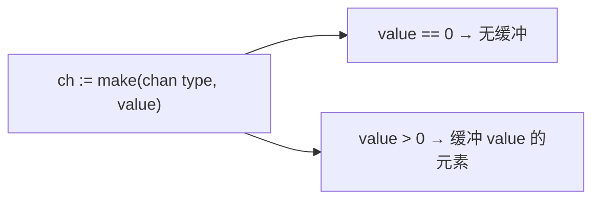
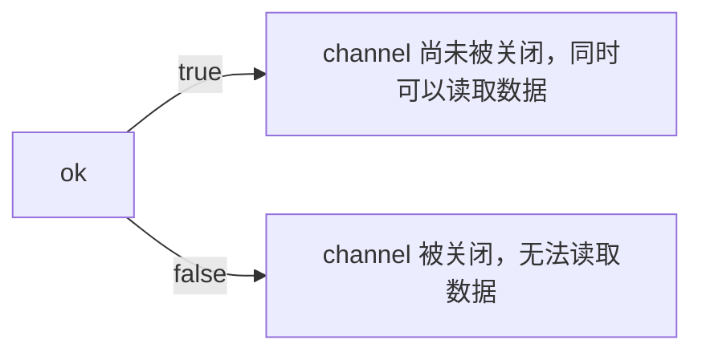

## goroutine

### 1. 是什么

goroutine 是 Go 语言中的轻量级线程实现，由 Go 运行时（runtime）管理。Go 程序会智能地将 goroutine 中的任务合理地分配给每个 CPU。

轻量：仅比分配栈空间多一点点消耗。而初始时栈是很小的，所以它们也是廉价价的，并且随着需要在堆空间上分配（和释放）

Go 程序从 main 包的 main() 函数开始，在程序启动时，Go 程序就会为 main() 函数创建一个默认的 goroutine。

**goroutine 是一个普通的函数**，只是需要使用关键字 go 作为开头

```go
ready("Tea", 2) // ← 普通函数调用
go ready("Tea", 2) // ← ready() 作为 goroutine 运行
```

### 2. 示例

```go
func ready(w string , sec int) {
	time.Sleep(time.Duration(sec) * time.Second)
	fmt.Println(w, "is ready!")
}

func main() {
	go ready("Tea", 2)
	go ready("Coffee", 1)
	fmt.Println("I'm waiting")
	time.Sleep(5 * time.Second)
}

// Outs：
// I'm waiting ← 立刻
// Coffee is ready! ← 1 秒后
// Tea is ready! ← 2 秒后
```

如果不等待 goroutine 的执行（ time.Sleep(5 \* time.Second)），程序立刻终止，而任何正在执行的 goroutine 都会停止。为了修复这个，需要一些能够同 goroutine 通讯的机制。这一机制通过 channels 的形式使用。

## Channel

### 1. 是什么

channel 可以与 Unix sehll 中的双向管道做类比：可以通过它发送或者接收值。这些值只能是特定的类型：channel 类型。

### 2. 定义和使用 Channel

#### 1. 定义

定义一个 channel 时，也需要定义发送到 channel 的值的类型。

:::tip
必须使用 make 创建 channel
:::

```go
ci := make(chan int)
cs := make(chan string)
cf := make(chan interface { })
```

-   创建 `channel ci` 用于发送和接收整数
-   创建 `channel cs` 用于字符串
-   以及 `channel cf` 使用了空接口来满足各种类型

#### 2. 使用

向 channel 发送或接收数据，是通过类似的操作符完成的：

> <−. 具体作用则依赖于操作符的位置：
>
> -   ci <− 1 ← 发送整数 1 到 channel ci
>
> -   <−ci ← 从 channel ci 接收整数
>
> -   i := <−ci ← 从 channel ci 接收整数，并保存到 i 中

#### 3. 示例

```go
var c chan int // Step.0

func ready(w string , sec int) {
	time.Sleep(time.Duration(sec) * time.Second)
	fmt.Println(w, "is ready!")
	c <− 1 // Step.1
}

func main() {
	c = make(chan i n t) // Step.2
	go ready("Tea", 2) //Step.3
	go ready("Coffee", 1)
	fmt.Println("I'm waiting, but not too long")
	<−c //Step.4
	<−c //Step.5
}
```

-   0 定义 c 作为 int 型的 channel。就是说：这个 channel 传输整数。注意这个变量是全局的，这样 goroutine 可以访问它
-   1 发送整数 1 到 channel c
-   2 初始化 c
-   3 用关键字 go 开始一个 goroutine
-   4 等待，直到从 channel 上接收一个值。注意，收到的值被丢弃了
-   5 两个 goroutines，接收两个值

:::warning
这里读取了两次值，在这个例子中还是比较清晰，但是当项目复杂不知道启动了多少个 goroutine 就会变得复杂，我们可以使用 `select` 关键字处理
:::

### 3. select

```go
var c chan int // Step.0

func ready(w string , sec int) {
	time.Sleep(time.Duration(sec) * time.Second)
	fmt.Println(w, "is ready!")
	c <− 1 // Step.1
}

func main() {
	c = make(chan i n t) // Step.2
	go ready("Tea", 2) //Step.3
	go ready("Coffee", 1)
	fmt.Println("I'm waiting, but not too long")
	for {
		select {
			case <−c:
			i++
			if i > 1 {
				break;
			}
		}
	}
}
```

现在将会一直等待下去。只有当从 `channel c` 上收到多个响应时才会退出循环

### 4. 并行运行

虽然 goroutine 是并发执行的，但是它们并不是并行运行的。如果不告诉 Go 额外的
东西，**同一时刻只会有一个 goroutine 执行**。利用 `runtime.GOMAXPROCS(n)` 可以设置 goroutine 并行执行的数量

> GOMAXPROCS 设置了同时运行的 CPU 的最大数量，并返回之前的设置。如果 n < 1，不会改变当前设置。当调度得到改进后，这将被移除

:::tip
如果不希望修改任何源代码，同样可以通过设置环境变量 `GOMAXPROCS` 为目标值。
:::

### 5. more channel

#### 1. 无缓冲 channel

当在 Go 中用 ch := make(chan bool) 创建 chennel 时，bool 型的 无缓冲 channel 会被创建。

> 这对于程序来说意味着什么呢？
>
> 首先，如果读取（value := <−ch）它将会被阻塞，直到有数据接收。
>
> 其次，任何发送（ch<−5）将会被阻塞，直到数据被读出。

**无缓冲 channel 是在多个 goroutine 之间同步很棒的工具**

#### 2. 有缓冲 channel

Go 也允许指定 channel 的缓冲大小，很简单，就是 channel 可以存储多少元素。
ch := make(chan bool, 4)，创建了可以存储 4 个元素的 bool 型 channel。在这个
channel 中，前 4 个元素可以无阻塞的写入。当写入第 5 个元素时，代码将会阻塞，直
到其他 goroutine 从 channel 中读取一些元素，腾出空间。



### 6. 关闭 channel

当 channel 被关闭后，读取端需要知道这个事情

```go
x, ok = <−ch
```


