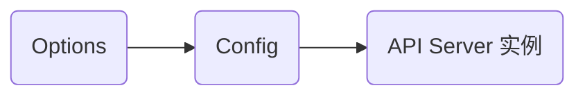
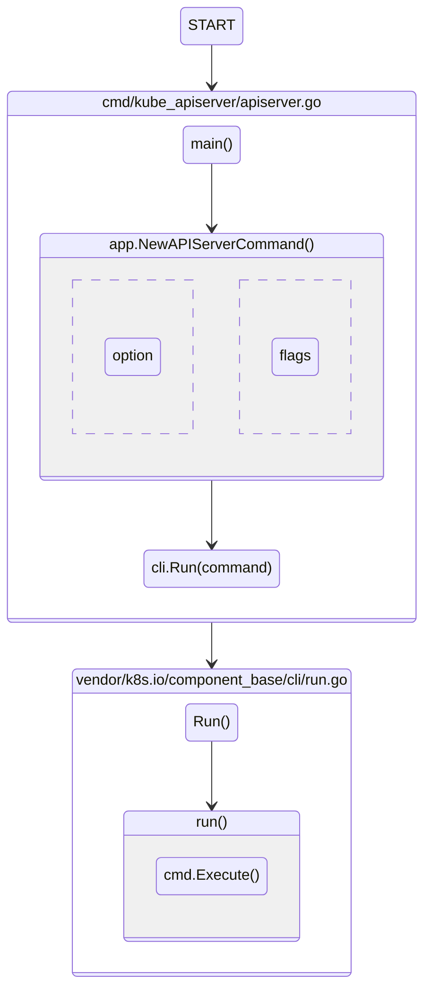
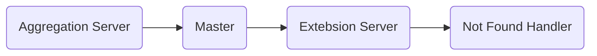
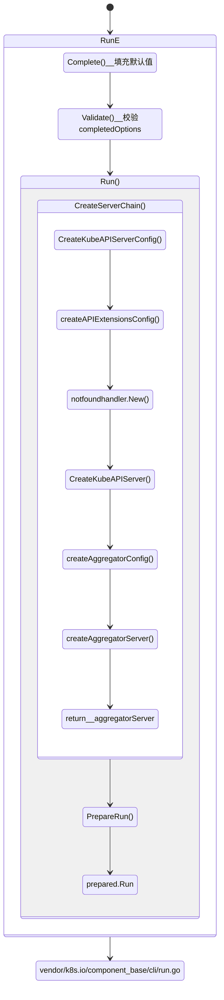

## 准备工作


- 推荐书籍


### 目录梳理

-   `./cmd/kube-apiserver`

    >   API Server 可执行程序的主入口，基于 cobra，主要负责接受命令行参数，也是代码学习的入口

-   `./vendor/k8s.io` 和 `./staging/src/k8s.io`

    >   vendor 机制是老一代版本依赖管理机制，module 是新一代。不过 vendor 目录存在还是会被优先使用；staging 中包含正在被单独抽离的组件，软引用到 vendor 下

-   `./pkg`

    >   大部分源码所在地，除了被抽离为单独组件的部分，例如 api-server 的代码，proxy 相关的代码，kubelet 组件的代码等

-   `./pkg/api`和`./pkg/apis`

    >   api 文件下包含 OpenAPI 相关的模型定义等内容，用于根据 OpenAPI 规范形成符合规定的 API

    >   apis 是包含内建 API Groups 和 API Objects 的，和 scheme 相关的代码大部分在这里

-   `./plugin`

    >   Kubernetes 内建的 plugin 实现，包含 admission 和 auth 两个部分


## API Server 启动过程

**重点**

-   `API Object`

    >   Kubernetes 内部管理的基本元素，是 k8s 在 ETCD 中信息存储单元。
    >
    >   例如：Deployment、Pod、Service 都是 API Object，代码内部也常用 "API" 来称呼他们。

-   `API Group`

    > 一组 API Object 组成的一个具有共性的对象集合。
    >
    >例如：apps 这个 group 它是由 Deployment、ReplicaSet、StatefulSet 等 API Object 组成的

-   `Legacy API Object`

    >   绝大多数的 API Object 都被归在某个 API Group 下面，特别是新版本引入的一定会遵从这一原则，但在 k8s 项目初始化阶段引入的 API Object 没有显示定义在 API Group。例如 Pod
    >
    >   Event、Node 等。在代码中有时也称呼他们为 "core" API Object

**[了解 Cobra](https://brook-w.com/pages/b4af77/)**

:::details 示例 （kube-apiserver）

```go
func NewAPIServerCommand() *cobra.Command {
	s := options.NewServerRunOptions()
	cmd := &cobra.Command{
		Use: "kube-apiserver",
		Long: `The Kubernetes API server validates and configures data
for the api objects which include pods, services, replicationcontrollers, and
others. The API Server services REST operations and provides the frontend to the
cluster's shared state through which all other components interact.`,

		// stop printing usage when the command errors
		SilenceUsage: true,
		PersistentPreRunE: func(*cobra.Command, []string) error {
			// silence client-go warnings.
			// kube-apiserver loopback clients should not log self-issued warnings.
			rest.SetDefaultWarningHandler(rest.NoWarnings{})
			return nil
		},
		RunE: func(cmd *cobra.Command, args []string) error {
			verflag.PrintAndExitIfRequested()
			fs := cmd.Flags()

			// Activate logging as soon as possible, after that
			// show flags with the final logging configuration.
			if err := s.Logs.ValidateAndApply(utilfeature.DefaultFeatureGate); err != nil {
				return err
			}
			cliflag.PrintFlags(fs)

			// set default options
			completedOptions, err := Complete(s)
			if err != nil {
				return err
			}

			// validate options
			if errs := completedOptions.Validate(); len(errs) != 0 {
				return utilerrors.NewAggregate(errs)
			}

			return Run(completedOptions, genericapiserver.SetupSignalHandler())
		},
		Args: func(cmd *cobra.Command, args []string) error {
			for _, arg := range args {
				if len(arg) > 0 {
					return fmt.Errorf("%q does not take any arguments, got %q", cmd.CommandPath(), args)
				}
			}
			return nil
		},
	}

	fs := cmd.Flags()
	namedFlagSets := s.Flags()
	verflag.AddFlags(namedFlagSets.FlagSet("global"))
	globalflag.AddGlobalFlags(namedFlagSets.FlagSet("global"), cmd.Name(), logs.SkipLoggingConfigurationFlags())
	options.AddCustomGlobalFlags(namedFlagSets.FlagSet("generic"))
	for _, f := range namedFlagSets.FlagSets {
		fs.AddFlagSet(f)
	}

	cols, _, _ := term.TerminalSize(cmd.OutOrStdout())
	cliflag.SetUsageAndHelpFunc(cmd, namedFlagSets, cols)

	return cmd
}
```

:::

### 代码预览

#### 目录结构

```sh
tree cmd/kube-apiserver
.
├── apiserver.go
├── app
│   ├── aggregator.go
│   ├── apiextensions.go
│   ├── options
│   │   ├── globalflags.go
│   │   ├── globalflags_providerless.go
│   │   ├── globalflags_providers.go
│   │   ├── globalflags_test.go
│   │   ├── options.go
│   │   ├── options_test.go
│   │   ├── validation.go
│   │   └── validation_test.go
│   ├── server.go
│   ├── server_test.go
│   └── testing
│       ├── testdata
│       │   ├── 127.0.0.1_10.0.0.1_kubernetes.default.svc-kubernetes.default-kubernetes-localhost.crt
│       │   ├── 127.0.0.1_10.0.0.1_kubernetes.default.svc-kubernetes.default-kubernetes-localhost.key
│       │   └── README.md
│       └── testserver.go
└── OWNERS
```

#### 主程序

```go
// cmd/kube-apiserver/apiserver.go
func main() {
	command := app.NewAPIServerCommand()
	code := cli.Run(command)
	os.Exit(code)
}
```

#### 命令主体

```go
// cmd/kube-apiserver/app/server.go
cmd := &cobra.Command{
    	// Use Long 描述用途
		Use: "kube-apiserver",
		Long: `The Kubernetes API server validates and configures data
for the api objects which include pods, services, replicationcontrollers, and
others. The API Server services REST operations and provides the frontend to the
cluster's shared state through which all other components interact.`,

		// stop printing usage when the command errors
		SilenceUsage: true,

    	// 在 Run 之前运行一些前置的指令，类似于拦截器
		PersistentPreRunE: func(*cobra.Command, []string) error {
			// silence client-go warnings.
			// kube-apiserver loopback clients should not log self-issued warnings.
			rest.SetDefaultWarningHandler(rest.NoWarnings{})
			return nil
		},

    	// 最终执行的指令
		RunE: func(cmd *cobra.Command, args []string) error {
			verflag.PrintAndExitIfRequested()
			fs := cmd.Flags()

			// Activate logging as soon as possible, after that
			// show flags with the final logging configuration.
			if err := s.Logs.ValidateAndApply(utilfeature.DefaultFeatureGate); err != nil {
				return err
			}
			cliflag.PrintFlags(fs)

			// set default options
			completedOptions, err := Complete(s)
			if err != nil {
				return err
			}

			// validate options
			if errs := completedOptions.Validate(); len(errs) != 0 {
				return utilerrors.NewAggregate(errs)
			}

			return Run(completedOptions, genericapiserver.SetupSignalHandler())
		},

    	// 检验 args 是否满足需求
		Args: func(cmd *cobra.Command, args []string) error {
			for _, arg := range args {
				if len(arg) > 0 {
					return fmt.Errorf("%q does not take any arguments, got %q", cmd.CommandPath(), args)
				}
			}
			return nil
		},
	}
```

#### 调用流程

##### 基本启动流程

[cmd/kube-apiserver/app/server.go](https://github.com/kubernetes/kubernetes/blob/v1.24.0/cmd/kube-apiserver/apiserver.go)





**Server Chain**



- Aggregation Server
	> 负责转发请求到 Master 或 Custom API Server
- Master
	> Kube API Server，负责 Build-in 的 API Object 相关的处理
	>
	> 例如：Pod，Event，apps ...
- Extebsion Server
	> Customer Resource 的处理由它完成，包括 CR 和 CRD
- Not Found Handler
	> 找不到相应的 API Object 的时候，返回 404

:::tip
在真正构建的时候会生成一个 pipeline 是从右向左，依次构建，当前层处理不了的请求流向下一层，直到 `Not Found Handler`
:::

##### RunE 启动

[cmd/kube-apiserver/app/server.go](https://github.com/kubernetes/kubernetes/blob/v1.24.0/cmd/kube-apiserver/app/server.go)




